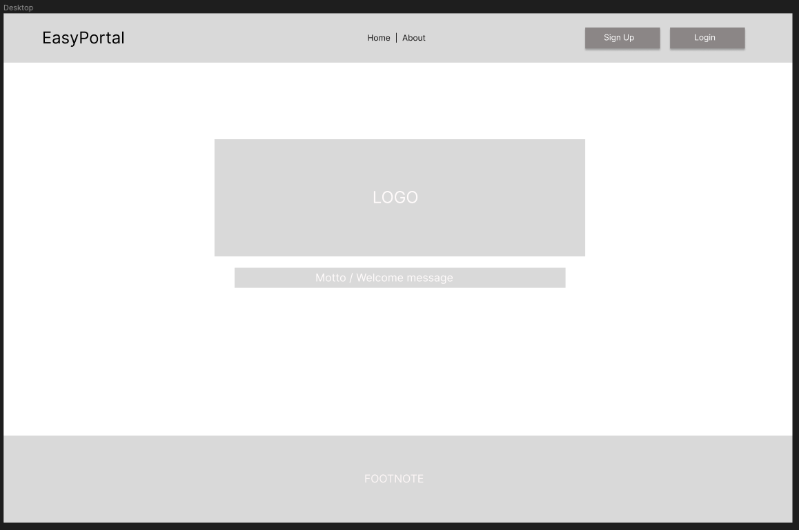
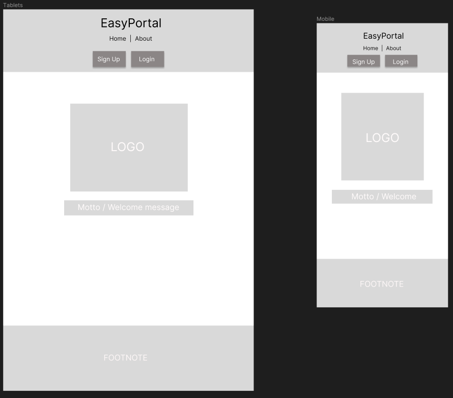
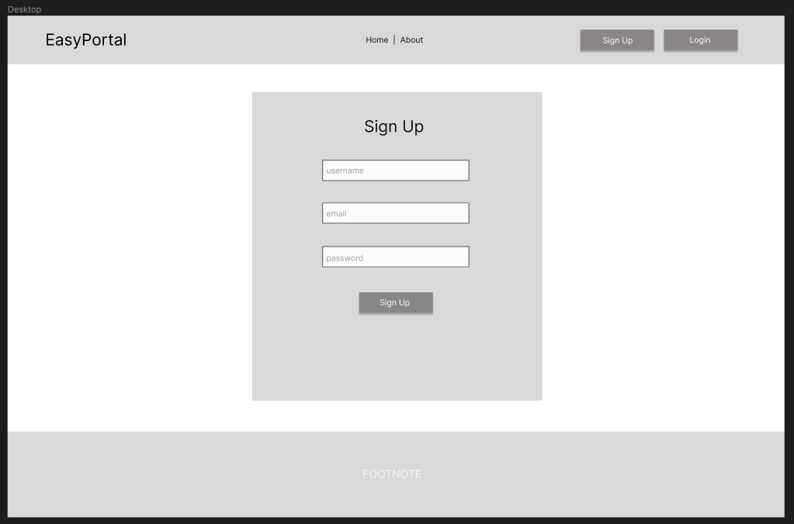
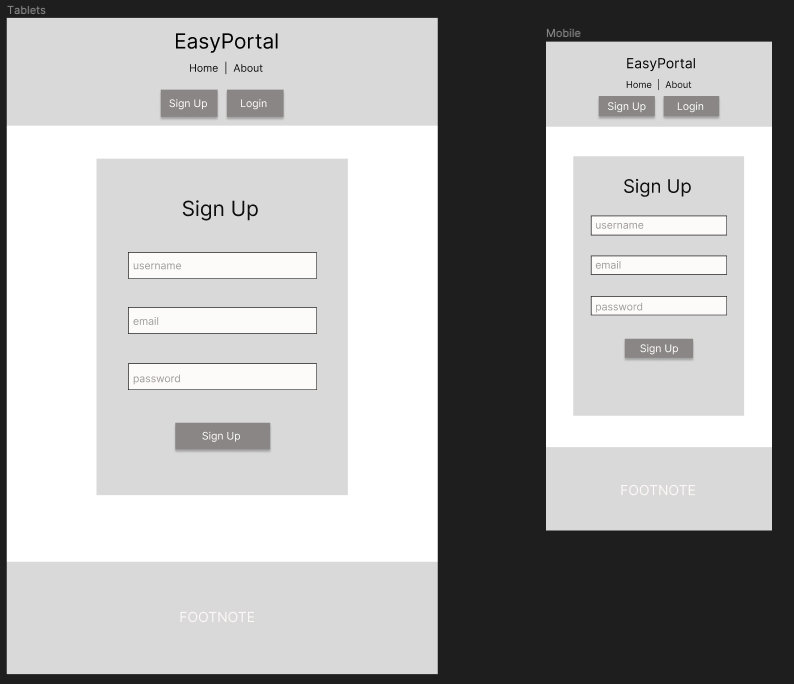
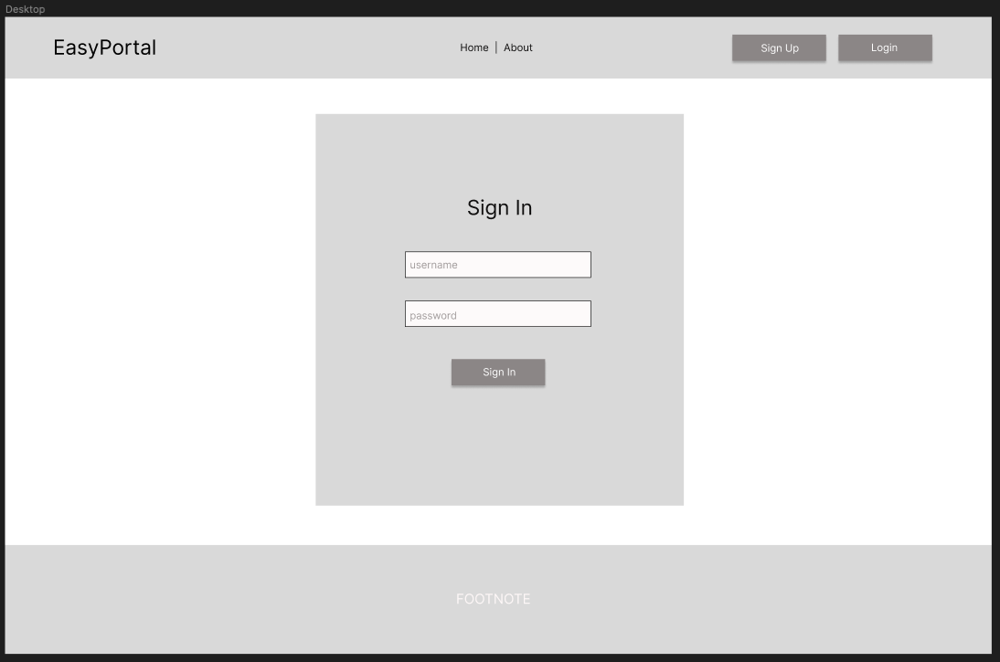
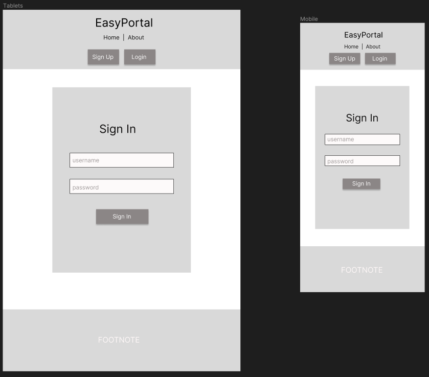
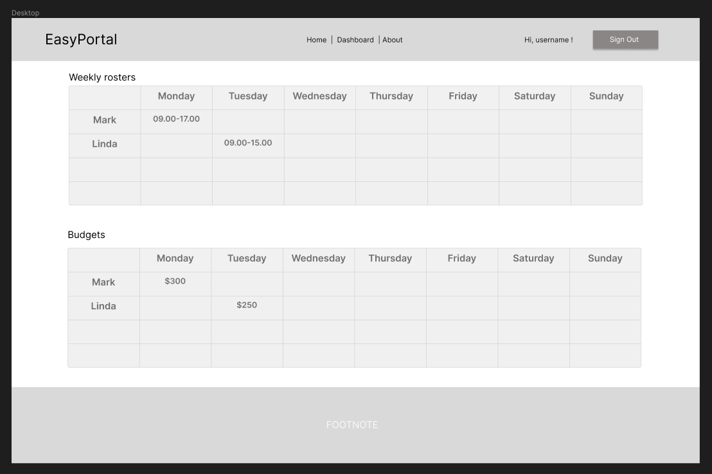
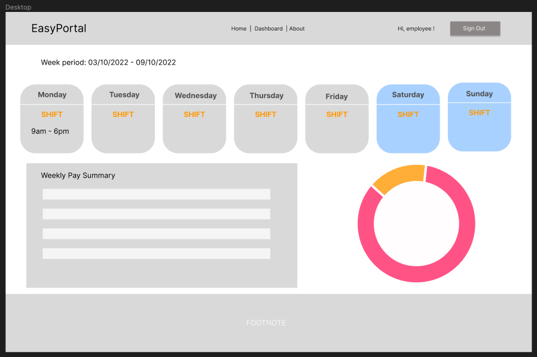
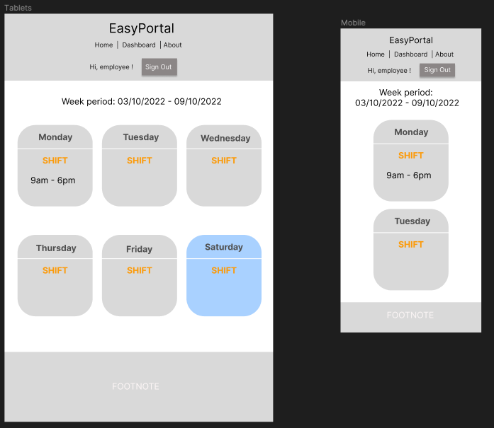
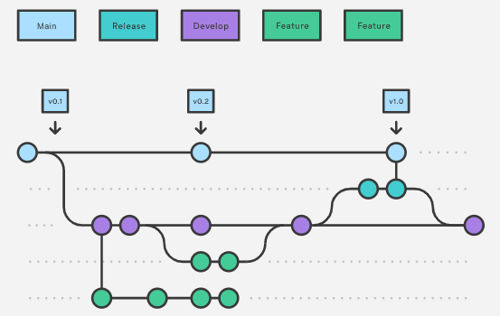

### Timotius Mogot and Morgan Rohan T3A2 - Part A 
# EasyPortal Business Management System Documentation

Link to project repository [here](https://github.com/EasyPortal-Business-Management-System/Part-A-docs)

## Authors
Timotius Mogot (link to github, linked in)
Morgan Rohan (link to github, linked in)

## Contents:
- Description
- Purpose 
- Functionality and Features
- Target Audience
- Tech Stack
- Dataflow Diagram
- Application Architecture
- User Stories
- Wireframes
- Project Management

## Description
### Purpose

Manage, calculate and display employees payroll and scheduling activities.

### Functionality and Features

- Employee Log in to view own profile
- Employer log in to view own profile
- Set up profile by answering series of questions (stores data and retrieves data based on responses) - Sign up process
- ‘At a glance’ graphics
- View worked hours
- View estimated pay
- View accrued leave
- View performance review
- Upload documents (police check, identity check, employer references)
- Submit leave request
- Access to employee register and overview (For employer login)
- Upload performance review 
- Roster employees

### Target Audience

Businesses that have casual, part time and full time employees with irregular working hours. 

### Tech Stack
#### Front-end:
- HTML
- JavaScript
- CSS
- React

#### Back-end:
- Express
- Node.js 

#### Database:
- MongoDB
- Mongoose

#### Deployment:
- Netlify
- Heroku

#### Project Management Tools:
- Trello
- Discord

#### DevOps Tools:
- Git
- GitHub
- Visual Studio Code

#### Design Tools:
- Figma
- Lucidchart
- Miro

## Dataflow Diagram
The below dataflow diagram helps to explain the flow of data throughout the application and will be used to help build the application. It's models the core functionality of the application as well as the data stores that will be utilised. 

## Application Archtecture
The below diagram shows the overall architecture and structure of the application. Generally the application can be broken down into three main areas; the Client side, Server side and the Database. For the application, we have chosen to use a MERN structure, with each component included in the diagram to show its function. 

## User Stories
The user stories below are focused on the needs and experiences of the employees and employers who would be using the EasyPortal application. Whilst a guest, or non-signed in user may be considered for application development, this is not relevant to EasyPortal since it will essentially be used within a private environment. Since the rosters and pay information of employees is private business information, a user without an account will only be able to view the home page and be prompted to sign in or create their account. 

#### Employee:
- As an employee, I want to be able to easily check my roster without having to go into my workplace.
- As an employee, I want to see my pay estimate for the week, so I can know what I'm getting paid.

#### Employer:
- As an employer, I want to be able to view the current employee roster, so I can see how well staffed my business is. 
- As an employer, I want to be able to add a new shift to the roster.
- As an employer, I want to be able to edit an existing shift in the roster.
- As an employer, I want to be able to delete an existing shift in the roster.
- As an employer, I want my employees to be able view their roster, so I know they can see their shifts.

#### User Persona 1:

- As the gym owner, I want to easily make roster changes, so that I can spend less time doing business administration.
- As the gym owner, I want to use a business management system, so that my employee information is all in one place.
- As the gym owner, I want to spend less time making roster changes, so that I can spend more time training with clients.
- As the gym owner, I want to have my business management system on my work computer, so that I can get more work-life balance.

#### User Persona 2:

- As a working parent, I want to check my roster easily, so that I can balance my work with spending time with my kids. 
- As someone with a mortgage and kids, I want to check my pay estimate, so that I know what my pay is and can budget for it. 
- As a working parent, I want to know my roster, so that I can make sure I have weekends off to go camping with my family. 
- As a part-time worker, I want to see my pay estimate, so that I can make a savings plan for our family holiday. 

#### User Persona 3:

- As a student, I want to know what my roster is in advance, so that I can attend my uni classes.
- As a casual worker, I want to check my pay estimate, so that I can budget for my week.
- As a casual worker, I want to easily view changes to my roster, so that I can make plans with friends. 

## Wireframes

Homepage - Desktop

Homepage - Tablets and Mobile

Sign up - Desktop

Sign up - Tablets and Mobile

Login - Desktop

Login - Tablets and Mobile

Main Dashboard Admin (Employer) - Desktop only

Main Dashboard Employee - Desktop

Main Dashboard Employee - Tablets and Mobile

## Project Management
The team started off with an initial brainstorming session to land on an application concept and functions. From this we decided to that project management for the application would be done primarily through a Trello board, updated daily, and other communication through Discord. 

The team decided on Monday, Tuesday and Wednesday as the main days of communication and dedicated work time. Therefore, at the beginning of each week a rough set of outcomes were listed for the week, then the Monday morning catch up Discord call was used to discuss these and update the Trello board, including assignment of workload. At the end of the day, the team checked in again to show the work product of the day and offer the other any necessary feedback. This same structure was then repeated for Tuesday and Wednesday of each week. The morning and afternoon check ins were also prime opportunities to screenshot the Trello board to show updates, as accessed [here](./docs/Trello%20Screenshots/). Work was also completed outside of these times as necessary, but the focus of the team was to plan and manage our time to try and complete the tasks within those specified days. 

It was decided that a kanban style methodlogy would be used and implemented through the digital kanban board on Trello. This approach was chosen in order to remain flexible and break down the project into smaller tasks, rather than set time periods. As team members, we also discussed how different tasks or requirements were better suited to our skills and that a kanban approach gave us this flexibility. An example of this is how some of the documentation requirements were assigned, with Morgan working on the user stories and Timotius assigned the wireframes. On the day these tasks were to be completed, the team met in the morning to discuss the big picture and confirm we were aligned, before working separately on the tasks. Once we had each completed the work for the day, we shared the finished product for feedback and made any changes before then uploading to the project repository. We found this an effective way to work, allowing each of us to work to our strengths whilst also maintaining a single purpose and aligned outcome.  

Alongside the project management, the team discussed how the workflow would be best used in order to manage changes from each collaborator. For this it was decided that a Gitflow workflow would work best for the team and kanban methodology of the project. This involved establishing a central repository with the main branch (deployed version of the application), development branch (for a working or staging version of the application) and feature branchs for each new feature or function of the application. We decided on this in order to best suit the division of workload within the project and to minimise merge conflicts. The diagram below shows an example of how the workflow was used for the project:
